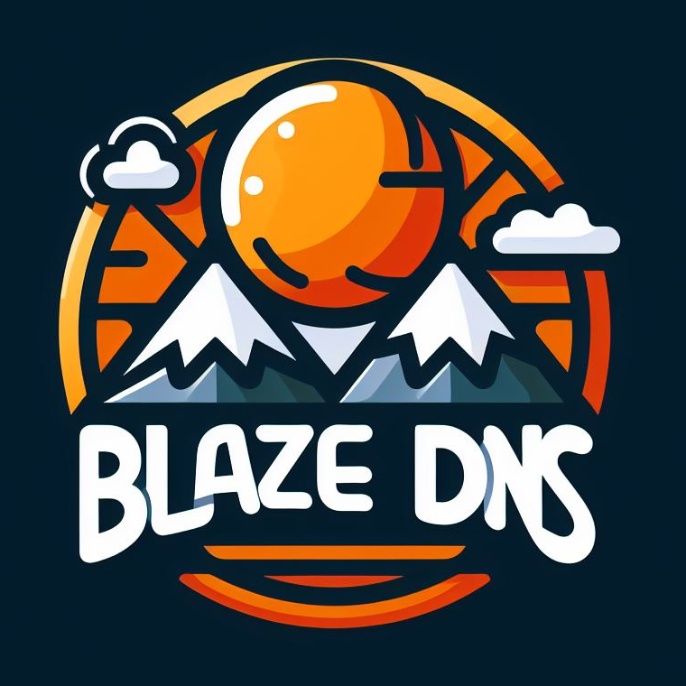

# blazeDNS

blazeDNS is an application witch helps with managing BIND configuration via WebUI

## About

Application is a part of project [DevOps Tinker](https://mateoops.github.io/)
This is a backend service. To run full application you should also install webUI service and BIND service

## Features

TODO

## Configuration

TODO
